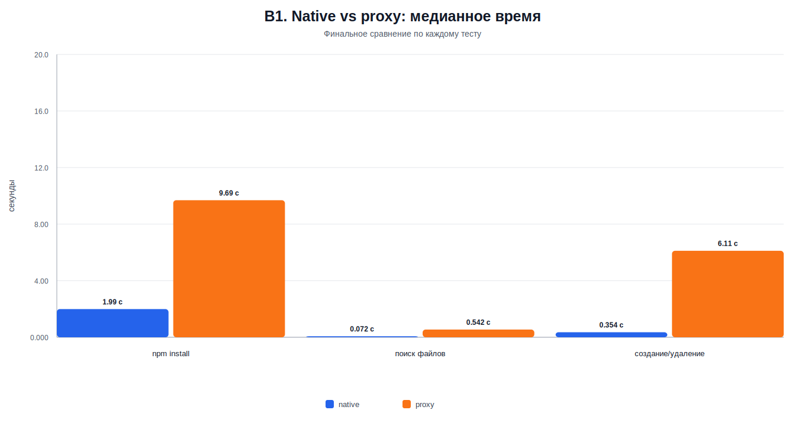
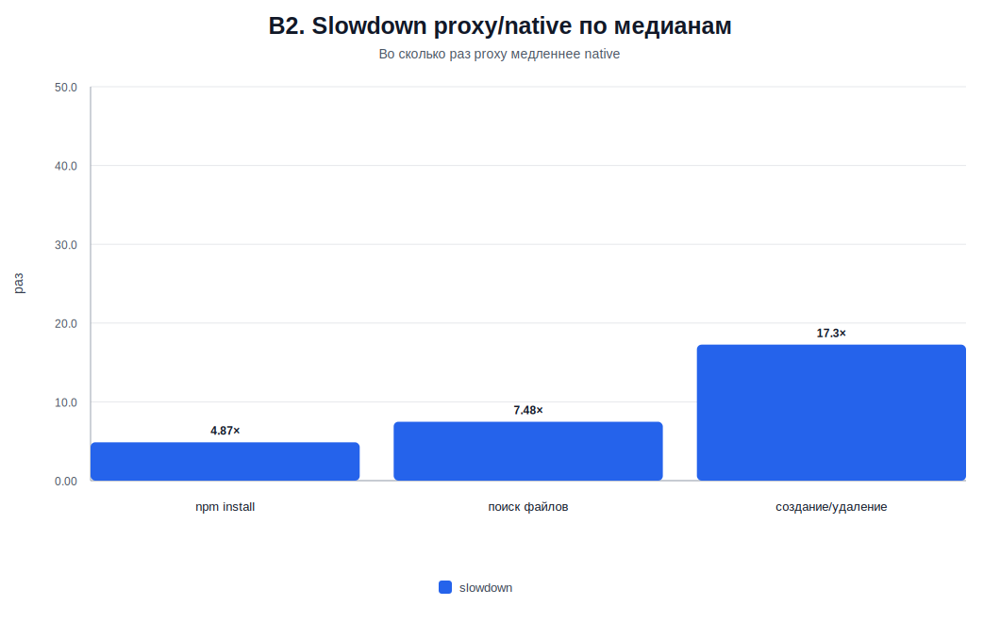
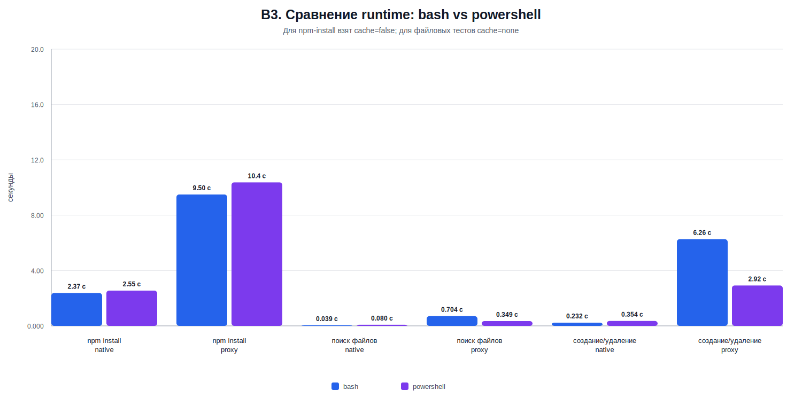

# Отчёт по результатам бенчмарков файловой системы Windows / WSL

## Summary

- Всего выполнено **240 прогонов**.
- Проверено **16 сценариев**: runtime, тест, режим ФС и режим cache для `npm-install`.
- `bash (Windows)` : **80 прогонов**; `bash (WSL)`: **80 прогонов**; `powershell`: **80 прогонов**.
- Для каждого `bash`-сценария есть **20 прогонов**, для каждого `powershell`-сценария — **10 прогонов**.
- Все графики и выводы ниже построены **только по медианным значениям `time`**.
- `proxy` медленнее `native` во всех тестах:
    - `npm-install` — **4.87×**
    - `files-find` — **7.48×**
    - `files-create-delete` — **17.3×**
- Главный практический вывод: если проект запускается в Unix-среде, он должен лежать в **WSL FS**, а не в `C:\`.
- Это не тонкая оптимизация, а базовое условие стабильной и быстрой разработки.

## `native` / `proxy`

- `native` — проект лежит в файловой системе, локальной для runtime;
- `proxy` — runtime работает с проектом через границу файловых систем;
- для WSL это означает: `native` — Linux FS внутри WSL, `proxy` — доступ к Windows FS, например к `C:\`, через слой
  совместимости.

## Главные медианные результаты

| Тест                  | Native, медиана | Proxy, медиана | Slowdown proxy/native |
|-----------------------|----------------:|---------------:|----------------------:|
| `npm-install`         |        1.99 сек |       9.69 сек |                 4.87× |
| `files-find`          |       0.072 сек |      0.542 сек |                 7.48× |
| `files-create-delete` |       0.354 сек |       6.11 сек |                 17.3× |

Короткий вывод: `proxy` проигрывает во всех тестах. Это значит, что проблема не в одном конкретном инструменте, а в
самой модели доступа к файлам через границу файловых систем.

## A. Медианное время по тестам и режимам

Вывод: `proxy` медленнее во всех тестах. Особенно заметна разница на операциях, где создаётся, удаляется или обходится
много файлов.

## B. Финальные графики: для презентации результата

### B1. Сравнение медианного времени native vs proxy по каждому тесту

Вывод: хранение проекта в «чужой» ФС создаёт постоянную цену на каждую файловую операцию. Чем больше файлов трогает
инструмент, тем сильнее эффект.

### B2. Отношение slowdown proxy/native по медианам

Вывод: `proxy` даёт не небольшую просадку, а кратное замедление. Для создания и удаления файлов разница достигает *
*17.3×**.

### B3. Сравнение runtime: bash vs powershell, где применимо

Вывод: runtime влияет на абсолютные цифры, но не меняет главный вывод. Ключевой фактор — не оболочка, а то, где лежит
проект относительно среды запуска.

| Тест              | Режим  | bash, медиана | powershell, медиана |
|-------------------|--------|--------------:|--------------------:|
| npm install       | native |      2.37 сек |            2.55 сек |
| npm install       | proxy  |      9.50 сек |            10.4 сек |
| поиск файлов      | native |     0.039 сек |           0.080 сек |
| поиск файлов      | proxy  |     0.704 сек |           0.349 сек |
| создание/удаление | native |     0.232 сек |           0.354 сек |
| создание/удаление | proxy  |      6.26 сек |            2.92 сек |

## Почему при разработке в Unix-среде проект должен быть в WSL

### Docker

Docker в Unix-сценарии ожидает, что исходники лежат рядом с Linux-файловой системой. Если проект находится в `C:\`,
контейнеры и WSL получают доступ к файлам через границу Windows/Linux. Это увеличивает задержки на чтение, запись и
синхронизацию.

- контейнеры медленнее стартуют;
- установка зависимостей занимает больше времени;
- проблема выглядит как «Docker тормозит», хотя причина часто в расположении проекта.

### npm, composer, pip и другие менеджеры зависимостей

Менеджеры зависимостей создают и читают много мелких файлов. `node_modules`, `vendor`, виртуальные окружения Python,
lock-файлы и кеши сильно зависят от скорости файловой системы.

Когда проект лежит в `C:\`, команда платит дополнительную цену почти на каждой операции. Кеш снижает часть нагрузки, но
не убирает фундаментальную проблему доступа через прослойку.

### Watcher’ы и dev-серверы

Watcher’ы следят за большим количеством файлов. Им важны быстрые события файловой системы и предсказуемая реакция на
изменения.

При хранении проекта в `C:\` возможны типовые проблемы:

- изменения подхватываются медленнее;
- dev-сервер чаще делает лишние пересканирования;
- hot reload кажется нестабильным;
- команда начинает искать проблему в webpack, Vite, nodemon, Docker или IDE, хотя источник — файловая модель.

## Правильная рабочая модель

Перенос проекта в WSL FS — это не «ускорение на потом». Это базовое архитектурное требование рабочего процесса, если
запуск идёт из Unix-среды.

Не стоит хранить проект в `C:\`, если основной запуск идёт через WSL, Docker или Linux-инструменты. Бенчмарки показывают
кратное замедление `proxy` по медианам, а значит команда будет регулярно терять время не на разработку, а на ожидание
файловых операций и разбор ложных проблем окружения.

Правильная рабочая модель:

- исходники проекта: `~/projects/<project>` внутри WSL;
- runtime: WSL/Linux;
- Docker и dev-инструменты: запуск из WSL;
- доступ из IDE: через WSL-интеграцию, а не через прямую работу с `C:\` как с основным местом проекта.

## Какие практики запретить

- Хранить Unix-проект в `C:\...` и запускать его из WSL.
- Работать из `/mnt/c/...` как из основной директории проекта.
- Делать Docker bind mount исходников из Windows FS для Linux-контейнеров, если есть возможность хранить проект в WSL.
- Устанавливать зависимости в проекте попеременно из Windows и WSL.
- Считать медленный `npm install`, нестабильный watcher или долгий Docker rebuild проблемой инструмента до проверки
  расположения проекта.

## Выигрыш после перехода

- Более быстрые установки зависимостей и операции с большим количеством файлов.
- Более стабильные watcher’ы, hot reload и dev-серверы.
- Более предсказуемые Docker bind mounts.
- Меньше ложных расследований «почему тормозит окружение».
- Единая рабочая модель для всей команды.
- Больше времени на разработку продукта вместо ожидания инфраструктуры
